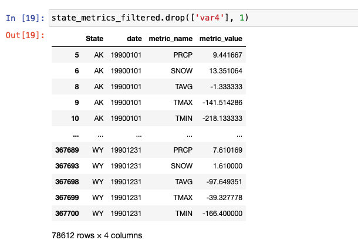

# 9650 Final Group Project

## Team Memembers: 
Shilpa Paidighantom, Carmen Ruan, Mingma Sherpa, 
Alexsandra Korzep, Katarzyna Borkowska, Lei Zhang
## Topic: Climate Change
---
**Problem Statement:**\
In this project, we are trying to answer the following questions:
* What are the key influencing factors of climate change in United States.
* How Meat Consumption, Food wastage are contributing to it?
* What will be the trend in next years?

**Objectives:**
* Perform factor analysis (PCA) to create climate change metric. Alternatively, climate change metric can be defined on one variable alone (such as daily average temperature)
* Build multivariate regression model to understand the drivers of climate change 
* Predict the impact of food industry on climate change and provide recommendations by states/clusters of states to reduce or control climate change 

**Table of Content**

1. [Data Collection](#Data-Collection)
2. [Data Processing](#Data-Processing)
3. [Data Cleaning](#Data-Cleaning)
4. [Data Analysis](#Data-Analysis)
5. [Related Reference](#Related-Reference)

#### Data Collection
We gathered information on targeted variables identified as data requirements. All data is collected from various sources ranging from organizational databases to the information in web pages. View all the data [here](https://github.com/snowmeatball/9650_GroupProject/blob/main/Data/readme.md)

Targeted variables:
* CO2 emission
* Petroleum carbon emission
* Natural gas carbon emission
* Electricity carbon emission
* Coal emission
* Population
* Natural gas consumption
* Petroleum consumption
* Coal consumption
* Meat consumption

#### Data Processing
The data obtained, may not be structured and may contain irrelevant information. Hence, the collected data is required to be subjected to Data Processing and Data Cleaning.

* Extracted data from 1990 to 2000 to the dataset we need. Here is an example how the data is processed:
```
raw data
```

```
new data
```



* Methodology to calculate the contribution of the factors affecting the climate change:
1. Segmentation: All the states in the US will be segmented for each year from 2010 to 2020 based on the evidence metrics such as 
    * TMAX
    * TMIN
    * TAVG
    * PRCP
    * SNOW
   
 ```
 Example of year 2020
 ```
<p align="center" width="100%">
     
</p>

#### Data Cleaning
The processed and organized data may be incomplete, contain duplicates, or contain errors.
To prevent errors, incorrect, corrupted, incorrectly formatted, duplicate, or incomplete data had been removed within a dataset. 

For example, the data below contains many columns with null values, which is incomplete and irrelevant to our topic, so those columns were removed.


#### Data Analysis
Within the data, here is what we found:
```
Climate change is real. Both global average temperature(top graph)and North American average temperature 
has increased by 1 degree in recent 20 years. It is beyong natural change. 
```
<p align="center" width="100%">
     
     
</p>

```
Analyzing hottest years by month, we see years >= 2000 among top 10. 7 out of 10 hottest years for January
is after the year 2020. This further shows how fast climate change is happening in the recent 20 years. 
```
<p align="center" width="100%">
     
</p>


#### Related Reference
